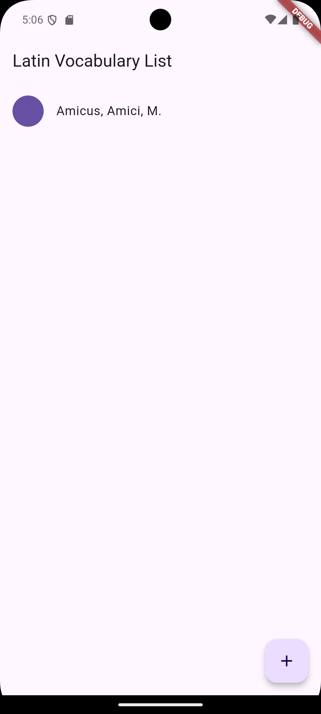
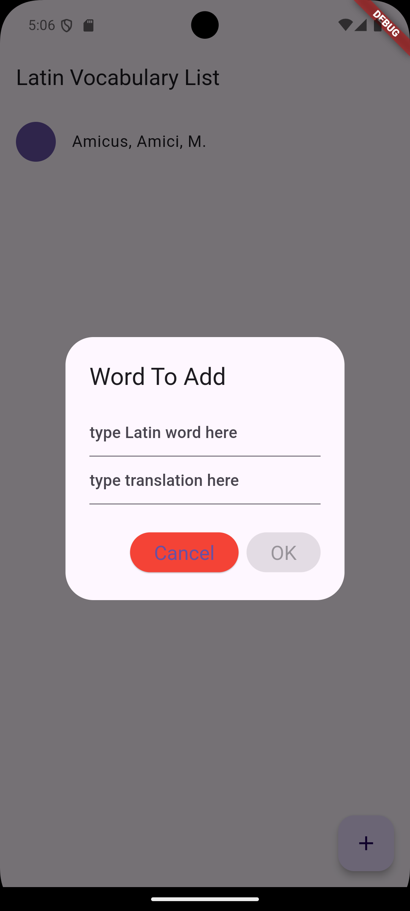
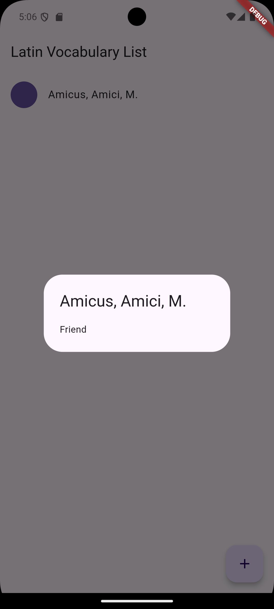

# latin-vocabulary-list
A list for Latin vocabulary!

The audience for this app is anyone interested in a list of Latin words with translations.
The app keeps a alphabetical list of Latin words with their translations. You can click on a word to see its translation.
It could be useful for people learning Latin to practice vocabulary!

