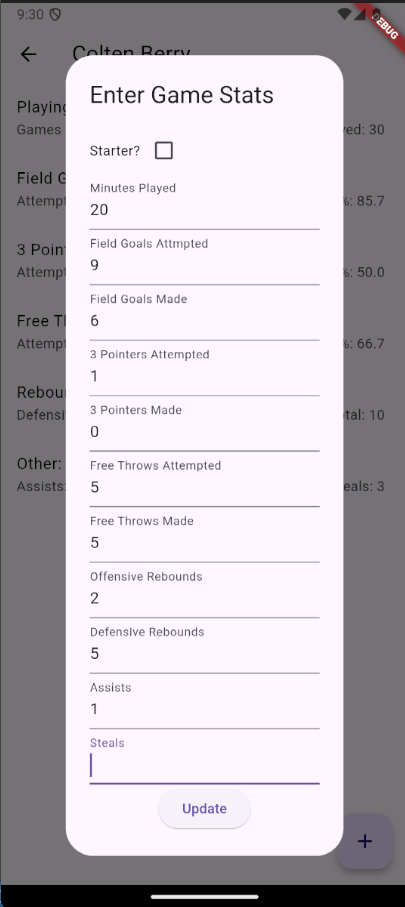
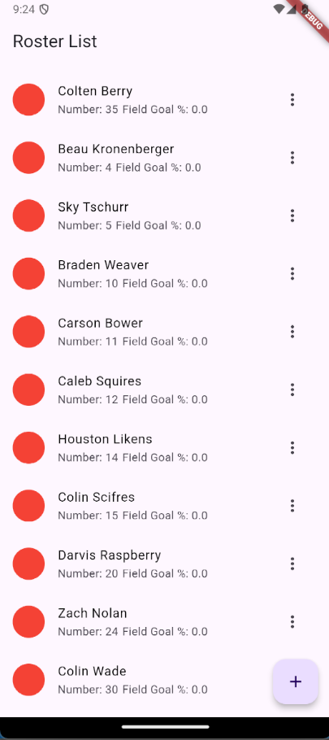
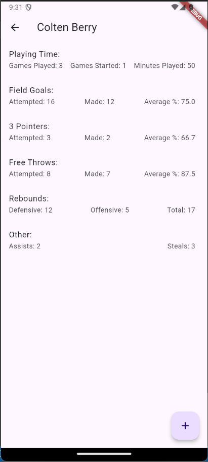
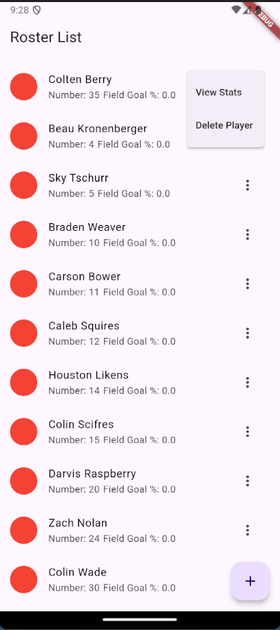

# Basketball-Roster-App

This is a project build using flutter. What it does is allow users to input a player into the app at the start of a season and then with each game, they can update the stats with the player's stats for that game. This app will keep track of the player's total stats and update their averages. The app also allows players to be deleted and added so that the roster can be accurately displayed with each new season. Many websites do a poor job displaying all of the stats in an easy, clear to read manner. This app will allow stats to be read easily on mobile. 

<picture>

</picture>